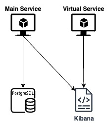
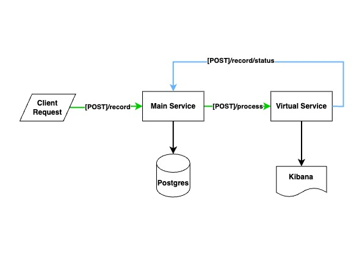

# WorqCompany Assesment Project


This is a sample project that requested by the WorqCompany for assesment purpose.

## Table of Contents
- [Task](#task)
- [Installation](#installation)
- [Usage](#usage)
- [Running Services](#running-services)
- [Testing Services](#testing-services)
- [Running Tests](#running-tests)

## Task
- Creating a Main Service in 3-Tier Architecture that supports SAGA Choreography 
- Creating a Virtual Service    for SAGA execution
- Both services are written with FAS

## System Topology



### Main Service
- Saves record to database
- Sends logs to kibana

### Virtual service
- Sends audit logs to kibana
   

## Business Flow


- The request sent by the client being saved to database in `CREATED` status
- When the **Virtual Service** proceses the request successfully; **Main Service** gets notified by **Virtual Service** about the situation
- The **Record**'s status gets updated as `PROCESSED` or `FAILED` accordingly


## Installation

1. Clone the repository:
    ```bash
    git clone https://github.com/baranius/worqcompany-project.git
    cd worqcompany-project
    ```

2. The repository consists of 2 different applications. The steps below requires you to pick preferred project first and run them for each project:
    ```bash
    cd main_serivce
    # or
    cd virtual_service

3. Create and activate a virtual environment:
    ```bash
    python3 -m venv venv
    source venv/bin/activate  # On Windows, use `venv\Scripts\activate`
    ```

3. Install the required dependencies:
    ```bash
    pip install -r requirements.txt
    ```

## Running Services
- Go to your download path
    ```bash
    cd <your-download-path>/worqcompany-project
    ```

- Run docker-compose
    ```bash
    docker-compose up
    ```

## Testing Services
- When the `docker-compose up` command executed successfully:
  - Main Service : http://localhost:8000
  - Virtual Service : http://localhost:8001
  - Kibana: http://localhost:5601
  - PostgreSQL: 
    - Host: localhost
    - Port: 5432
    - User: test_user
    - Password: S3c23t

## Running Tests
Tests are written with pytest. To run the tests:

```bash
cd main_service
PYTHONPATH=./ pytest tests/

# or

cd virtual_service
PYTHONPATH=./ pytest tests/
```
